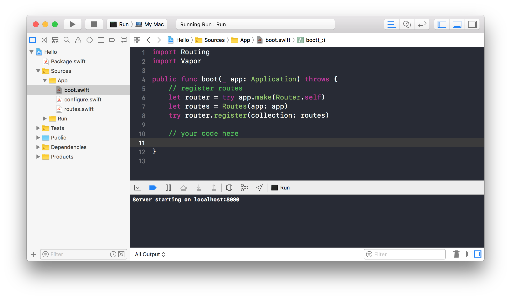

# Xcode

如果使用 Mac ，你可以通过 Xcode 来开发 Vapor 项目。你可以在Xcode中 编译、运行和停止服务，也可以使用断点和工具来调试代码。



通常是使用 Xcode 进行 Vapor 应用的开发，但也可以选择任何你喜欢的文本编辑器。

## 生成项目

想要使用 Xcode ，你只需要通过 [Vapor Toolbox](toolbox.md) 生成 Xcode 项目即可。

```
vapor xcode
```

> 提示
> 
> 不用担心生成的Xcode项目会被提交到git仓库，需要的时候尽管生成新Xcode项目。

## 运行

首先确保 scheme 选中为 ```Run``` 后才可以编译运行 Vapor 应用。同时也确保 device 选择 "My Mac"。


一旦选择好后，只需要点击播放按钮或者使用快捷键 ```Command + R``` 。

## 测试


选择以 ```-Package``` 结尾的 scheme 并使用快捷键 ```Command + U``` 就能运行单元测试。

> 提示
> 下拉菜单中可能会出现一些其它的 scheme 选项，忽略它们即可！